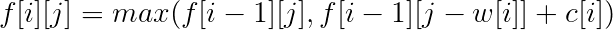
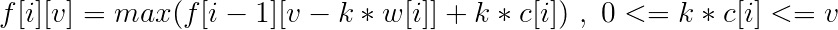
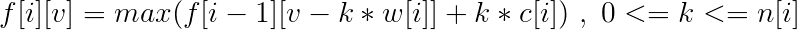
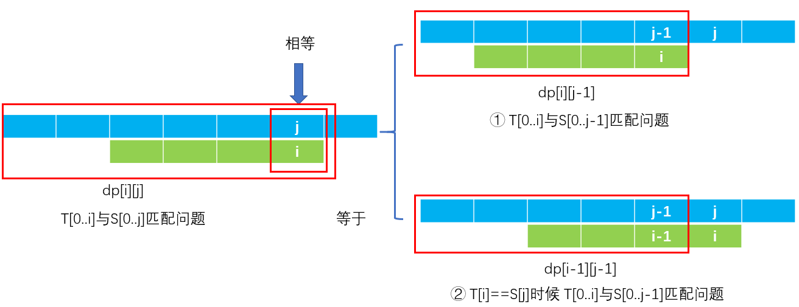

### 动态规划概念

动态规划的思想了：动态规划（Dynamic Programming）是一种分阶段求解决策问题的数学思想。总结起来就是一句话，大事化小，小事化了。

+ 常见的动态规划问题

线性动规：拦截导弹，合唱队形，挖地雷，建学校，剑客决斗等；

区域动规：石子合并， 加分二叉树，统计单词个数，炮兵布阵等；

树形动规：贪吃的九头龙，二分查找树，聚会的欢乐，数字三角形等；

背包问题：01背包问题，完全背包问题，分组背包问题，二维背包，

### 0-1背包问题

有N件物品和一个容量为V的背包。第i件物品的价格（即体积，下同）是w[i]，价值是c[i]。求解将哪些物品装入背包可使这些物品的费用总和不超过背包容量，且价值总和最大。

这是最基础的背包问题，总的来说就是：选还是不选，这是个问题

相当于用`f[i][j]`​表示考虑前​`i​`个物品装入容量为`j`的背包中所可以获得的最大价值。

对于一个物品，只有两种情况

　　情况一: 第i件不放进去，这时所得价值为:`f[i-1][j]`

　　情况二: 第i件放进去，这时所得价值为：`f[i-1][j-c[i]]+w[i] `

状态转移方程为：



```c
#include<stdio.h>
#include<algorithm>
using namespace std;
int f[1001][1001];
int main()
{
    int m, n,c[10001], w[10001];
     scanf("%d%d", &m, &n);					//m是物品种类，n是背包能承载的重量
     for(int i = 1; i <= m; i++)
       scanf("%d%d", &w[i], &c[i]);
     for(int i = 1; i <= m; i++)
     {
         for(int j = 0; j <= n; j++)
         {
             f[i][j] = f[i-1][j];
             if(j>=w[i])
           	 	f[i][j] = max(f[i][j], f[i-1][j-w[i]]+c[i]);
         }
     }
     printf("%d", f[m][n]);
     return 0;  
}
```

还可以进行空间优化

设 `f[v]`表示背包还可以放入`v`公斤物品时候能得到的最大价值（若背包最大能承受`n`重量，`f(n)`表示未放入任何物品时候的价值）， 则状态转移方程：`f[v]=max(f[v]，f[v-w[i]]+c[i]) `，当v>=w[i]，1<=i<=n 。

```c
#include<stdio.h>
#include<algorithm>
using namespace std;
const int maxm = 2001, maxn = 101;
int m, n;
int w[maxn], c[maxn];
int f[maxm]; 
int main()
{
    scanf("%d%d",&m, &n);            		//背包容量m和物品数量n
    for (int i=1; i <= n; i++)
        scanf("%d%d",&w[i],&c[i]);     		//每个物品的重量和价值
    for (int i=1; i <= n; i++)            	//设f(v)表示重量不超过v公斤的最大价值
        for (int v = m; v >= w[i]; v--)  	//注意是逆序
            f[v] = max(f[v-w[i]]+c[i], f[v]);
    printf("%d\n",f[m]);                    // f(m)为最优解
    return 0;
}
```


### 完全背包问题

有N种物品和一个容量为V的背包，每种物品都有无限件可用。第i种物品的费用是w[i]，价值是c[i]。求解将哪些物品装入背包可使这些物品的费用总和不超过背包容量，且价值总和最大。

完全背包和01背包十分相像， 区别就是完全背包物品有无限件。由之前的选或者不选转变成了选或者不选，选几件。

和0-1背包一样，有状态转移方程：



```cpp
#include<stdio.h>
#include<algorithm>
using namespace std;
const int maxm=2001,maxn=101;
int n,m,v,i;
int c[maxn],w[maxn];
int f[maxm];
int main()
{
    scanf("%d%d",&m,&n);           		 //背包容量m和物品数量n
    for(i=1;i<=n;i++) 
        scanf("%d%d",&w[i],&c[i]);
    for(i=1;i<=n;i++)
        for(v=w[i]; v<=m; v++)          //设 f[v]表示重量不超过v公斤的最大价值
                                        //这里是v++ 顺序 区别于01背包 
            f[v]=max(f[v-w[i]]+c[i], f[v]);
    printf("%d\n", f[m]);           	// f[m]为最优解
    return 0;
}
```


### 多重背包问题

有N种物品和一个容量为V的背包。第i种物品最多有`n[i]`件可用，每件费用是`w[i]`，价值是`c[i]`。求解将哪些物品装入背包可使这些物品的费用总和不超过背包容量，且价值总和最大。

这里又多了一个限制条件，每个物品规定了可用的次数。

同理，可以得出状态转移方程：



一道例题

【问题描述】

为了庆贺班级在校运动会上取得全校第一名成绩，班主任决定开一场庆功会，为此拨款购买奖品犒劳运动员。期望拨款金额能购买最大价值的奖品，可以补充他们的精力和体力。

【输入格式】

第一行二个数n(n<=500)，m(m<=6000)，其中n代表希望购买的奖品的种数，m表示拨款金额。 接下来n行，每行3个数，v、w、s，分别表示第I种奖品的价格、价值（价格与价值是不同的概念）和购买的数量（买0件到s件均可），其中v<=100，w<=1000，s<=10。

【输出格式】

第一行：一个数，表示此次购买能获得的最大的价值（注意！不是价格）。

【输入样例】

5 1000

80 20 4

40 50 9

30 50 7

40 30 6

20 20 1

【输出样例】

1040

```c
#include<stdio.h>
#include<algorithm>
using namespace std;
int v[6002], w[6002], s[6002];
int f[6002];
int n, m;
int main()
{
    scanf("%d%d",&n,&m);
    for (int i = 1; i <= n; i++)
        scanf("%d%d%d",&v[i],&w[i],&s[i]);
    for (int i = 1; i <= n; i++)
       for (int j = m; j >= 0; j--)
          for (int k = 0; k <= s[i]; k++)
          {
               if (j-k*v[i]<0) break;
               f[j] = max(f[j],f[j-k*v[i]]+k*w[i]);
          }
    printf("%d\n",f[m]);
    return 0;
}
```


### [不同的子序列](https://leetcode-cn.com/problems/distinct-subsequences/)

**题目：**

给定一个字符串 S 和一个字符串 T，计算在 S 的子序列中 T 出现的个数。

一个字符串的一个子序列是指，通过删除一些（也可以不删除）字符且不干扰剩余字符相对位置所组成的新字符串。（例如，"ACE" 是 "ABCDE" 的一个子序列，而 "AEC" 不是）

示例 1:

```
输入: S = "rabbbit", T = "rabbit"
输出: 3
解释:

如下图所示, 有 3 种可以从 S 中得到 "rabbit" 的方案。
(上箭头符号 ^ 表示选取的字母)

rabbbit
^^ ^^
rabbbit
^^ ^^
rabbbit
^ ^

```

**“凡是涉及到字符串匹配/子串的问题都可以用回溯法或者动态规划”**

**“回溯法时间复杂度较高，动态规划用空间换取时间”**

动态规划关键是找到递推公式， 而找到递推公式，首先就是要找到如何表示数组dp 然后找到递推关系。

可以发现，此题和编辑距离一样。都是由两个字符串， 是从一个字符串变到另一个字符串， 对于编辑距离这个题是在字符串1进行增， 删， 改操作变到字符串2， 此题是在字符串1里找到字符串2。

所以对于此题我们先构造dp， 类似于编辑距离， 定义`dp[i][j]`，表示字符串1的从初始位置开始长度为i的字符串，即`T[0...i-1]`， 在字符串2的从初始位子开始长度为j的字符串（即`S[0...j-1]`） 中匹配的个数。

关键就是要找递推式

**“动态规划就是用规模较小的子问题'组合、推广'得到规模较大的原始问题”**

先看对于当前问题`dp[i][j]`，比当前问题规模小的问题有：

`dp[i-1][j]`：表示串`T`的从初始位置开始长度为`i-1`的子串， 在串`S`的从初始位置开始长度为`j`的子串中串匹配的个数。其实和当前问题没什么关系。

`dp[i-1][j-1]`：表示串`T`的从初始位置开始长度为`i-1`的子串， 在串`S`的从初始位子开始长度为`j-1`的子串中匹配的个数。

`dp[i][j-1]`：子串`T[0...i]`在子串`S[0...j-1]`重匹配的个数

**确定子问题**

先固定目标串子问题T，设当前长度为`i`，候选串S，当前长度为`j`，

现在来分情况讨论

当`T[i]与S[j]相等`时

```
dp[i][j] = dp[i][j-1]+dp[i-1][j-1]
```



当`T[i]与S[j]不相等`时

```
dp[i][j] = dp[i][j-1]
```

找到了递推式子

```c
dp[i][j] = dp[i][j-1] +  (s[i] == t[j]) ? dp[i-1][j-1] : 0
```

代码

```c++
class Solution {
public:
    int numDistinct(string s, string t) {
        int m = t.length();
        int n = s.length();
        if(n<m) return 0;
        vector<vector<long>> dp(m+1,vector<long>(n+1,0));
        for(int i=0;i<=n;++i)
            dp[0][i] =1;
        for(int i=1;i<=m;++i)
        {
            for(int j=i;j<=n;++j)
            {
                if(t[i-1]!=s[j-1])
                    dp[i][j] = dp[i][j-1];
                else
                    dp[i][j] = dp[i-1][j-1]+dp[i][j-1];
            }
        }
        //show(dp);
        return dp[m][n];
    }
};
```

### [分割回文串II](https://leetcode-cn.com/problems/palindrome-partitioning-ii/)

**题目**

给定一个字符串 s，将 s 分割成一些子串，使每个子串都是回文串。

返回符合要求的最少分割次数。

```
示例:
输入: "aab"
输出: 1
解释: 进行一次分割就可将 s 分割成 ["aa","b"] 这样两个回文子串。
```

**思路**

之前还有一题也是回文串相关问题[最长回文子串](https://leetcode-cn.com/problems/longest-palindromic-substring/) 都很难😭

```c++
本题不要求求出具体分割方案，可以考虑使用动态规划求解。
假设输入字符串为’aabac’:
|a |a　|b　|a　|c　|
0　１　 ２　３　 4　 5
可以创建一个数组res来存储每个位置的初始最小分割次数
也就是当字符串中完全没有回文串时的最大分割次数，即[-1,0,1,2,3,4]。
（如何进一步更新每个位置需要的分割次数呢？）可以先来依次遍历每个分割位，实验观察一下res的变化。
在位置0时，不做更新。
在位置1时，不做更新。
在位置2时，发现’aa’可以构成回文串，res更新为[-1,0,0,2,3,4]。
在位置3时，最小分割为’aa’和’b’，需要一次分割，res更新为[-1,0,0,1,3,4]。
在位置4时，最小分割为’a’和’aba’，需要一次分割，res更新为[-1,0,0,1,1,4]。
在位置5时，最小分割为’a’，‘aba’和’c’，需要两次分割，res更新为[-1,0,0,1,1,2]。
可以得出一下结论，当在分割位i时，若s[j:i]为回文串：
	那么res[i]的分割次数为在分割位j的次数res[j] + 1。
题目要求是最少的次数，因此j遍历0到i-1的所有位置,求出res[i]的最小值
最后只要返回res[-1]就是我们要的答案。

另外如果每次都判断s[j:i]是否是回文串会有很多次重复判断，从而导致超时。
解决方法是空间换时间，创建一个二维数组if_palindrome来存储所有子字符串是否是回文串。
这个二维数组的赋值操作可以在上述循环中同时进行
若s[j:i]首尾相等，中间部分也是回文串或者s[j:i]的长度小于等于2(即中间部分为空)
则s[j:i]为回文串，if_palindromej = True。
```

**代码**

```c++
class Solution {
public:
    int minCut(string s) {
        int n = s.length();
        vector<int> dp(n+1,INT_MAX);
        for(int i=0;i<=n;++i)
            dp[i] =i-1;
        vector<vector<bool>> circleStr(n,vector<bool>(n,true));
        for(int i=1;i<n;++i)
        {
            for(int j=i;j>=0;--j)
            {
                if(s[j]==s[i] &&( (i-j)<2 || circleStr[j+1][i-1]))
                    dp[i+1] = min(dp[j]+1,dp[i+1]);
                else
                {
                    circleStr[j][i] = false;
                }
            }
        }
        return dp[n];
    }
};
```


