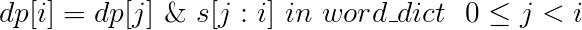

### 动态规划概念

动态规划的思想了：动态规划（Dynamic Programming）是一种分阶段求解决策问题的数学思想。总结起来就是一句话，大事化小，小事化了。

+ 常见的动态规划问题

线性动规：拦截导弹，合唱队形，挖地雷，建学校，剑客决斗等；

区域动规：石子合并， 加分二叉树，统计单词个数，炮兵布阵等；

树形动规：贪吃的九头龙，二分查找树，聚会的欢乐，数字三角形等；

背包问题：01背包问题，完全背包问题，分组背包问题，二维背包，

### 0-1背包问题

有N件物品和一个容量为V的背包。第i件物品的价格（即体积，下同）是w[i]，价值是c[i]。求解将哪些物品装入背包可使这些物品的费用总和不超过背包容量，且价值总和最大。

这是最基础的背包问题，总的来说就是：选还是不选，这是个问题

相当于用`f[i][j]`​表示考虑前​`i​`个物品装入容量为`j`的背包中所可以获得的最大价值。

对于一个物品，只有两种情况

　　情况一: 第i件不放进去，这时所得价值为:`f[i-1][j]`

　　情况二: 第i件放进去，这时所得价值为：`f[i-1][j-c[i]]+w[i] `

状态转移方程为：


```c
#include<stdio.h>
#include<algorithm>
using namespace std;
int f[1001][1001];
int main()
{
    int m, n,c[10001], w[10001];
     scanf("%d%d", &m, &n);					//m是物品种类，n是背包能承载的重量
     for(int i = 1; i <= m; i++)
       scanf("%d%d", &w[i], &c[i]);
     for(int i = 1; i <= m; i++)
     {
         for(int j = 0; j <= n; j++)
         {
             f[i][j] = f[i-1][j];
             if(j>=w[i])
           	 	f[i][j] = max(f[i][j], f[i-1][j-w[i]]+c[i]);
         }
     }
     printf("%d", f[m][n]);
     return 0;  
}
```

还可以进行空间优化

设 `f[v]`表示背包还可以放入`v`公斤物品时候能得到的最大价值（若背包最大能承受`n`重量，`f(n)`表示未放入任何物品时候的价值）， 则状态转移方程：`f[v]=max(f[v]，f[v-w[i]]+c[i]) `，当v>=w[i]，1<=i<=n 。

```c
#include<stdio.h>
#include<algorithm>
using namespace std;
const int maxm = 2001, maxn = 101;
int m, n;
int w[maxn], c[maxn];
int f[maxm]; 
int main()
{
    scanf("%d%d",&m, &n);            		//背包容量m和物品数量n
    for (int i=1; i <= n; i++)
        scanf("%d%d",&w[i],&c[i]);     		//每个物品的重量和价值
    for (int i=1; i <= n; i++)            	//设f(v)表示重量不超过v公斤的最大价值
        for (int v = m; v >= w[i]; v--)  	//注意是逆序
            f[v] = max(f[v-w[i]]+c[i], f[v]);
    printf("%d\n",f[m]);                    // f(m)为最优解
    return 0;
}
```


### 完全背包问题

有N种物品和一个容量为V的背包，每种物品都有无限件可用。第i种物品的费用是w[i]，价值是c[i]。求解将哪些物品装入背包可使这些物品的费用总和不超过背包容量，且价值总和最大。

完全背包和01背包十分相像， 区别就是完全背包物品有无限件。由之前的选或者不选转变成了选或者不选，选几件。

和0-1背包一样，有状态转移方程：


```cpp
#include<stdio.h>
#include<algorithm>
using namespace std;
const int maxm=2001,maxn=101;
int n,m,v,i;
int c[maxn],w[maxn];
int f[maxm];
int main()
{
    scanf("%d%d",&m,&n);           		 //背包容量m和物品数量n
    for(i=1;i<=n;i++) 
        scanf("%d%d",&w[i],&c[i]);
    for(i=1;i<=n;i++)
        for(v=w[i]; v<=m; v++)          //设 f[v]表示重量不超过v公斤的最大价值
                                        //这里是v++ 顺序 区别于01背包 
            f[v]=max(f[v-w[i]]+c[i], f[v]);
    printf("%d\n", f[m]);           	// f[m]为最优解
    return 0;
}
```


### 多重背包问题

有N种物品和一个容量为V的背包。第i种物品最多有`n[i]`件可用，每件费用是`w[i]`，价值是`c[i]`。求解将哪些物品装入背包可使这些物品的费用总和不超过背包容量，且价值总和最大。

这里又多了一个限制条件，每个物品规定了可用的次数。

同理，可以得出状态转移方程：


一道例题

【问题描述】

为了庆贺班级在校运动会上取得全校第一名成绩，班主任决定开一场庆功会，为此拨款购买奖品犒劳运动员。期望拨款金额能购买最大价值的奖品，可以补充他们的精力和体力。

【输入格式】

第一行二个数n(n<=500)，m(m<=6000)，其中n代表希望购买的奖品的种数，m表示拨款金额。 接下来n行，每行3个数，v、w、s，分别表示第I种奖品的价格、价值（价格与价值是不同的概念）和购买的数量（买0件到s件均可），其中v<=100，w<=1000，s<=10。

【输出格式】

第一行：一个数，表示此次购买能获得的最大的价值（注意！不是价格）。

【输入样例】

5 1000

80 20 4

40 50 9

30 50 7

40 30 6

20 20 1

【输出样例】

1040

```c
#include<stdio.h>
#include<algorithm>
using namespace std;
int v[6002], w[6002], s[6002];
int f[6002];
int n, m;
int main()
{
    scanf("%d%d",&n,&m);
    for (int i = 1; i <= n; i++)
        scanf("%d%d%d",&v[i],&w[i],&s[i]);
    for (int i = 1; i <= n; i++)
       for (int j = m; j >= 0; j--)
          for (int k = 0; k <= s[i]; k++)
          {
               if (j-k*v[i]<0) break;
               f[j] = max(f[j],f[j-k*v[i]]+k*w[i]);
          }
    printf("%d\n",f[m]);
    return 0;
}
```


### [不同的子序列](https://leetcode-cn.com/problems/distinct-subsequences/)

**题目：**

给定一个字符串 S 和一个字符串 T，计算在 S 的子序列中 T 出现的个数。

一个字符串的一个子序列是指，通过删除一些（也可以不删除）字符且不干扰剩余字符相对位置所组成的新字符串。（例如，"ACE" 是 "ABCDE" 的一个子序列，而 "AEC" 不是）

示例 1:

```
输入: S = "rabbbit", T = "rabbit"
输出: 3
解释:

如下图所示, 有 3 种可以从 S 中得到 "rabbit" 的方案。
(上箭头符号 ^ 表示选取的字母)

rabbbit
^^ ^^
rabbbit
^^ ^^
rabbbit
^ ^

```

**“凡是涉及到字符串匹配/子串的问题都可以用回溯法或者动态规划”**

**“回溯法时间复杂度较高，动态规划用空间换取时间”**

动态规划关键是找到递推公式， 而找到递推公式，首先就是要找到如何表示数组dp 然后找到递推关系。

可以发现，此题和编辑距离一样。都是由两个字符串， 是从一个字符串变到另一个字符串， 对于编辑距离这个题是在字符串1进行增， 删， 改操作变到字符串2， 此题是在字符串1里找到字符串2。

所以对于此题我们先构造dp， 类似于编辑距离， 定义`dp[i][j]`，表示字符串1的从初始位置开始长度为i的字符串，即`T[0...i-1]`， 在字符串2的从初始位子开始长度为j的字符串（即`S[0...j-1]`） 中匹配的个数。

关键就是要找递推式

**“动态规划就是用规模较小的子问题'组合、推广'得到规模较大的原始问题”**

先看对于当前问题`dp[i][j]`，比当前问题规模小的问题有：

`dp[i-1][j]`：表示串`T`的从初始位置开始长度为`i-1`的子串， 在串`S`的从初始位置开始长度为`j`的子串中串匹配的个数。其实和当前问题没什么关系。

`dp[i-1][j-1]`：表示串`T`的从初始位置开始长度为`i-1`的子串， 在串`S`的从初始位子开始长度为`j-1`的子串中匹配的个数。

`dp[i][j-1]`：子串`T[0...i]`在子串`S[0...j-1]`重匹配的个数

**确定子问题**

先固定目标串子问题T，设当前长度为`i`，候选串S，当前长度为`j`，

现在来分情况讨论

当`T[i]与S[j]相等`时

```
dp[i][j] = dp[i][j-1]+dp[i-1][j-1]
```


当`T[i]与S[j]不相等`时

```
dp[i][j] = dp[i][j-1]
```

找到了递推式子

```c
dp[i][j] = dp[i][j-1] +  (s[i] == t[j]) ? dp[i-1][j-1] : 0
```

代码

```c++
class Solution {
public:
    int numDistinct(string s, string t) {
        int m = t.length();
        int n = s.length();
        if(n<m) return 0;
        vector<vector<long>> dp(m+1,vector<long>(n+1,0));
        for(int i=0;i<=n;++i)
            dp[0][i] =1;
        for(int i=1;i<=m;++i)
        {
            for(int j=i;j<=n;++j)
            {
                if(t[i-1]!=s[j-1])
                    dp[i][j] = dp[i][j-1];
                else
                    dp[i][j] = dp[i-1][j-1]+dp[i][j-1];
            }
        }
        //show(dp);
        return dp[m][n];
    }
};
```

### [分割回文串II](https://leetcode-cn.com/problems/palindrome-partitioning-ii/)

**题目**

给定一个字符串 s，将 s 分割成一些子串，使每个子串都是回文串。

返回符合要求的最少分割次数。

```
示例:
输入: "aab"
输出: 1
解释: 进行一次分割就可将 s 分割成 ["aa","b"] 这样两个回文子串。
```

**思路**

之前还有一题也是回文串相关问题[最长回文子串](https://leetcode-cn.com/problems/longest-palindromic-substring/) 都很难😭

```c++
本题不要求求出具体分割方案，可以考虑使用动态规划求解。
假设输入字符串为’aabac’:
|a |a　|b　|a　|c　|
0　１　 ２　３　 4　 5
可以创建一个数组res来存储每个位置的初始最小分割次数
也就是当字符串中完全没有回文串时的最大分割次数，即[-1,0,1,2,3,4]。
（如何进一步更新每个位置需要的分割次数呢？）可以先来依次遍历每个分割位，实验观察一下res的变化。
在位置0时，不做更新。
在位置1时，不做更新。
在位置2时，发现’aa’可以构成回文串，res更新为[-1,0,0,2,3,4]。
在位置3时，最小分割为’aa’和’b’，需要一次分割，res更新为[-1,0,0,1,3,4]。
在位置4时，最小分割为’a’和’aba’，需要一次分割，res更新为[-1,0,0,1,1,4]。
在位置5时，最小分割为’a’，‘aba’和’c’，需要两次分割，res更新为[-1,0,0,1,1,2]。
可以得出一下结论，当在分割位i时，若s[j:i]为回文串：
	那么res[i]的分割次数为在分割位j的次数res[j] + 1。
题目要求是最少的次数，因此j遍历0到i-1的所有位置,求出res[i]的最小值
最后只要返回res[-1]就是我们要的答案。

另外如果每次都判断s[j:i]是否是回文串会有很多次重复判断，从而导致超时。
解决方法是空间换时间，创建一个二维数组if_palindrome来存储所有子字符串是否是回文串。
这个二维数组的赋值操作可以在上述循环中同时进行
若s[j:i]首尾相等，中间部分也是回文串或者s[j:i]的长度小于等于2(即中间部分为空)
则s[j:i]为回文串，if_palindromej = True。
```

**代码**

```c++
class Solution {
public:
    int minCut(string s) {
        int n = s.length();
        vector<int> dp(n+1,INT_MAX);
        for(int i=0;i<=n;++i)
            dp[i] =i-1;
        vector<vector<bool>> circleStr(n,vector<bool>(n,true));
        for(int i=1;i<n;++i)
        {
            for(int j=i;j>=0;--j)
            {
                if(s[j]==s[i] &&( (i-j)<2 || circleStr[j+1][i-1]))
                    dp[i+1] = min(dp[j]+1,dp[i+1]);
                else
                {
                    circleStr[j][i] = false;
                }
            }
        }
        return dp[n];
    }
};
```


#### [单词拆分](https://leetcode-cn.com/problems/word-break/)

给定一个非空字符串 s 和一个包含非空单词列表的字典 wordDict，判定 s 是否可以被空格拆分为一个或多个在字典中出现的单词。

说明：

拆分时可以重复使用字典中的单词。
你可以假设字典中没有重复的单词。

示例 1：
```
输入: s = "leetcode", wordDict = ["leet", "code"]
输出: true
解释: 返回 true 因为 "leetcode" 可以被拆分成 "leet code"。
```
示例 2：
```
输入: s = "applepenapple", wordDict = ["apple", "pen"]
输出: true
解释: 返回 true 因为 "applepenapple" 可以被拆分成 "apple pen apple"。
     注意你可以重复使用字典中的单词。
```
示例 3：
```
输入: s = "catsandog", wordDict = ["cats", "dog", "sand", "and", "cat"]
输出: false
```

**（一）暴力回溯法**

0. 原问题考虑s[0,:]能否以字典中的单词拆分

1. 对字符串s中子串s[start..end]判断是否在字典中
  a.若子串在，则递归的考虑s[end+1,:]能否单词拆分
  b. 若不在，则end=end+1，回到步骤(1)  （横向搜索）

  c.当前能拆分且之后都能拆分，返回true

2. 返回false

这里果不其然超时了，对于最坏情况`s="aaaaaaaa···aab"`和`wordDict={"a","aa","aaa",...}`这样的情况，每一个前缀都在字典中，每个字母可最多回溯n次，此时回溯树的时间复杂度会达到 n^n（n的n次方） 。

**（二）带备忘录的回溯法**

在暴力回溯中可以看到许多函数调用都是冗余的，也就是函数会对相同的字符串调用多次回溯函数。

例子：

```c++
s="aaab"
dict={"a","aa","aaa","aaaa"}
```


<p align="center">
	
	<p align="center">
		<em>单词拆分</em>
	</p>
</p>

**相同颜色的圆圈框出来的就是冗余调用**

为了避免这种情况，我们可以使用记忆化的方法，使用一个memo 数组会被用来保存子问题的结果。每当访问到已经访问过的后缀串，直接用memo 数组中的值返回而不需要继续调用函数，memo[i]表示字符串s从下标i 至结束都可进行单词拆分(true)或否（false）。

<p align="center">
	
	<p align="center">
		<em>单词拆分</em>
	</p>
</p>

```c++
class Solution {
public:
    bool wordBreak(string s, vector<string>& wordDict) {
        //9:31-9:46
        vector<int> memo(s.length(),-1);
        unordered_set<string> words(wordDict.begin(),wordDict.end());
        return helper(s,words,memo,0);
    }
    
    bool helper(const string &s,const unordered_set<string> &words,vector<int> &memo,int start)
    {
        if(start==s.length()) return true;
        if(memo[start]!=-1) return memo[start];
        for(int i=start;i<s.length();++i)
        {
            if(words.count(s.substr(start,i-start+1)) && helper(s,words,memo,i+1))
            {
                memo[start] = 1;
                return true;
            }
        }
        memo[start] =0;
        return false;
    }
};
```

**分析**

+ 时间复杂度：`O(n^2)`，每次字母最多回溯n次下，但计算过的子树不会在真正回溯多次
+ 空间复杂度：`O(n)` 。回溯树的深度可以达到` n `级别。

**（三）动态规划**

转移公式：



`dp[i]`表示字符串`s`自`开始`到下标`i-1`的子串能否被单词划分，它由`dp[j]`和单词`word=s[j:i]`是否在词典中共同决定，只要存在这样的`j`使得右边的式子为真，则`dp[i]`就为真。

```c++
class Solution {
public:
    bool wordBreak(string s, vector<string>& wordDict) {
        vector<bool> dp(s.length()+1,false);
        unordered_set<string> words(wordDict.begin(),wordDict.end());
        //dp[i] 表示到s[0..i-1]的字符串能被单词拆分
        if(s.empty()) return true;
        dp[0] = true;
        for(int i=1;i<=s.length();++i)
            for(int j=0;j<i;j++)
            {
                dp[i] = dp[j] && words.count(s.substr(j,i-j));
                if(dp[i]) break;//存在一次为真就跳出内部循环
            }
        return dp[s.length()];
    }
};
```

**分析**

+ 时间复杂度：`O(n^2)`，两个循环
+ 空间复杂度：`O(n)` 。一个数组

**（三）仿背包问题动态规划**

将字典中的单词视为物品

字符串视为背包，背包总容量有限，且只能放指定物品，且一种物品可以放多个

```c++
class Solution {
public:
    bool wordBreak(string s, vector<string>& wordDict) {
        vector<bool> dp(s.length()+1,false);
        unordered_set<string> words(wordDict.begin(),wordDict.end());
        //dp[i] 表示到s[0..i-1]的字符串能被单词拆分
        if(s.empty()) return true;
        dp[0] = true;//空字符肯定符合要求
        for(int i=1;i<=s.length();++i)
            for(auto word:words)
            {
                if(i<word.length()) continue;//s中起始位置至少要比一个单词长
                int pos= i-word.length();//计算起始位置
                dp[i] = dp[pos] && word==s.substr(pos,word.length());//从字典中取一个单词，看能否放进串s的对应位置
                if(dp[i]) break;
            }
        return dp[s.length()];
    }
};
```


