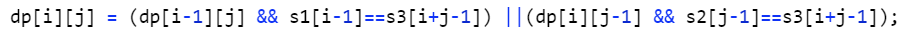

## [交错字符串](https://leetcode-cn.com/problems/interleaving-string/)

**题目**
给定三个字符串 s1, s2, s3, 验证 s3 是否是由 s1 和 s2 交错组成的。

示例 1:

输入: s1 = "aabcc", s2 = "dbbca", s3 = "aadbbcbcac"
输出: true
示例 2:

输入: s1 = "aabcc", s2 = "dbbca", s3 = "aadbbbaccc"
输出: false

**思路**
本题最先想到了用回溯法，但是回溯法调用函数栈时间复杂度较高，最终最后两个用例超时了

+ 回溯法
  指针i,j,k，分别表示s1[0..i-1]子串与s2[0..j-1]子串交错组成s3[0..k-1]子串(其实k=i+j-1)，若s1[i]==s3[k]则递归的看s1[0..i]子串与s2[0..j-1]子串交错组成s3[0..k]子串；否则看s2[i]是否等于s3[k]，若等于则递归的看看s1[0..i-1]子串与s2[0..j]子串交错组成s3[0..k]子串；否则返回false，之前的s1与s2组合不能交错组成s3。
  递归栈由于回溯会遍历所有情况，使得输出正确结果成为可能

```cpp
class Solution {
public:
    bool isInterleave(string s1, string s2, string s3) {
        if(s1.length()==0 && s2.length()==0 && s3.length()==0) return true;
        if(s3.length()==0) return false;
        if(s1.length()+s2.length()!= s3.length()) return false;
        return helper(s1,s2,s3,0,0,0);
    }
    
    bool helper(string &s1, string &s2, string &s3,int i,int j,int k)
    {
        bool res=false;
        if(k==s3.length())
            res = true;
        if(i<s1.length() && s1[i] == s3[k])
        {
            res=helper(s1,s2,s3,i+1,j,k+1);
        }
        if(!res && j<s2.length() && s2[j]==s3[k])
        {
            res=helper(s1,s2,s3,i,j+1,k+1);
        }
        return res;
    }
};
```

+ 二维动态规划
  dp[i][j] 表示s1[0,...,i-1]子串与s2[0,...,j-1]子串可以交错组成s3[0,..,i+j-1]子串
  转化公式：
  

```cpp
class Solution {
public:
    //用回溯法最后两个用例超出时间限制
    //字符串涉及子串匹配啥的统统dp完事儿
    bool isInterleave(string s1, string s2, string s3) {
        //dp[i][j] 表示s1[0,...,i-1]子串与s2[0,...,j-1]子串可以交错组成s3[0,..,i+j-1]子串
        int l1 = s1.length();
        int l2 = s2.length();
        if(l1+l2!=s3.length()) return false;
        vector<vector<bool> > dp(l1+1,vector<bool>(l2+1,true));
        //第一行，第一列
        for(int i=1;i<=l1;++i)
            dp[i][0] = dp[i-1][0] && s1[i-1]==s3[i-1];
        for(int i=1;i<=l2;++i)
            dp[0][i] = dp[0][i-1] && s2[i-1]==s3[i-1];
        for(int i=1;i<=l1;++i)
            for(int j=1;j<=l2;++j)
            {
                dp[i][j] = (dp[i-1][j] && s1[i-1]==s3[i+j-1]) ||(dp[i][j-1] && s2[j-1]==s3[i+j-1]);
            }
        return dp[l1][l2];
    }
};
```


