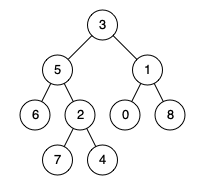

# [二叉树的最近公共祖先](https://leetcode-cn.com/problems/lowest-common-ancestor-of-a-binary-tree/submissions/)

**题目:**
给定一个二叉树, 找到该树中两个指定节点的最近公共祖先。

百度百科中最近公共祖先的定义为：“对于有根树 T 的两个结点 p、q，最近公共祖先表示为一个结点 x，满足 x 是 p、q 的祖先且 x 的深度尽可能大（一个节点也可以是它自己的祖先）。”

例如，给定如下二叉树:  root = [3,5,1,6,2,0,8,null,null,7,4]


示例 1:
>输入: root = [3,5,1,6,2,0,8,null,null,7,4], p = 5, q = 1
>输出: 3
>解释: 节点 5 和节点 1 的最近公共祖先是节点 3。

示例 2:
>输入: root = [3,5,1,6,2,0,8,null,null,7,4], p = 5, q = 4
>输出: 5
>解释: 节点 5 和节点 4 的最近公共祖先是节点 5。因为根据定义最近公共祖先节点可以为节点本身。


**说明:**
所有节点的值都是唯一的。
p、q 为不同节点且均存在于给定的二叉树中。

> 备注：LCA这个题目你好久没碰到过，应该复习复习二叉树的相关算法了，解析看你的代码备注

```cpp
/**
 * Definition for a binary tree node.
 * struct TreeNode {
 *     int val;
 *     TreeNode *left;
 *     TreeNode *right;
 *     TreeNode(int x) : val(x), left(NULL), right(NULL) {}
 * };
 */
class Solution {
public:
    TreeNode* lowestCommonAncestor(TreeNode* root, TreeNode* p, TreeNode* q) {
        if(!root || !p ||!q) return NULL;       //有一个为空则root为根结点的树查找失败，返回NULL
        if(root == p || root == q) return root; //当前结点是要查找的结点，立即返回当前结点
        TreeNode * left = lowestCommonAncestor(root->left,p,q);
        TreeNode * right= lowestCommonAncestor(root->right,p,q);
        if(left && right) return root;          //左右子树均查找到结果，当前结点是LCA，返回当前根节点
        else if(!left) return right;            //左子树未查找到，返回右子树，若右子树未查找到，返回的是NULL
        else return left;                       //否则返回左子树
    }
};
```