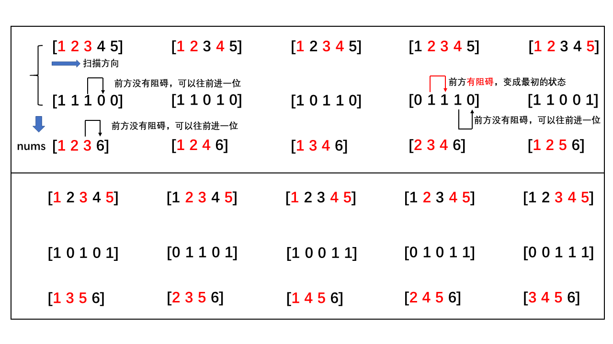

## 回溯法

在包含问题的所有解的解空间树中，按照`深度优先搜索的策略`，从根结点出发深度探索解空间树。当探索到某一结点时，要先判断该结点是否包含问题的解，如果包含，就从该结点出发继续探索下去，如果该结点不包含问题的解，则逐层向其祖先结点回溯。（其实回溯法就是对图的深度优先搜索算法）。

+ 若用回溯法求问题的所有解时，要回溯到根，且根结点的所有可行的子树都要已被搜索遍才结束。 
+ 而若使用回溯法求任一个解时，只要搜索到问题的一个解就可以结束。


## [组合总和_如何输出指定和的组合序列](https://leetcode-cn.com/problems/combination-sum-ii/)

**题目**

给定一个数组 `candidates` 和一个目标数 `target` ，找出 `candidates` 中所有可以使数字和为 `target` 的组合。

`candidates` 中的每个数字在每个组合中只能使用一次。

备注

+ 所有数字（包括目标数）都是正整数。
+ 解集不能包含重复的组合。 

**示例**

示例 1:

```
输入: candidates = [10,1,2,7,6,1,5], target = 8,
所求解集为:
[
  [1, 7],
  [1, 2, 5],
  [2, 6],
  [1, 1, 6]
]
```

示例 2:

```
输入: candidates = [2,5,2,1,2], target = 5,
所求解集为:
[
  [1,2,2],
  [5]
]
```

**说明**

代码一：

排列问题可以用DFS来做，因为candidates中同一个位置上的元素只能出现一次，可以先对candinates排序，再调用DFS，遍历时要从当前元素的下一个元素开始。又每种数字组合只能有一次，于是多个解向量，当选定第一个位置元素为1之后，第二个位置选2，那么其他的解向量若第一个元素为1，那么第二个元素就不能为2了，否则必然相同。

代码二：

相对于代码一，基本思路不变，但是可以用集合set来去重，set会自动去掉元素具有相同元素组合的vector，而不管vector中排列顺序，比如[1,1,2]和[1,2,1]在set眼中就是相同的。

**代码**

代码一

```c++
class Solution {
public:
    vector<vector<int>> combinationSum2(vector<int>& candidates, int target) {
        sort(candidates.begin(),candidates.end());
        DFS(candidates,target,0,0,candidates.size());
        return res;
    }
    
    void DFS(vector<int> & nums,int target,int sum,int cur,int n)
    {
        //找到一个组合满足要求
        if(sum > target)
            return;
        else if(sum == target)
        {
            res.push_back(path);//push_back会调用拷贝构造函数
            return;
        }
        else
        {
            for(int i =cur;i!=n;++i)
            {
                //和39题目的差别关键就在这下面这两句，
                //因为在前面对candidates排了序，因此对于任两个可行解向量
                //若res1[0]和res2[0]相同，则之后的元素也会相同，因此要避免
                if(i > cur && nums[i] == nums[i-1])
                    continue;
                int item = nums[i];
                path.push_back(item);
                DFS(nums,target,sum+item,i+1,n);
                path.pop_back();
            }
        }
    }
private:
    vector<int> path;
    vector<vector<int>> res;
};
```

代码二

```c++
class Solution {
public:
    vector<vector<int>> combinationSum2(vector<int>& candidates, int target) {
        sort(candidates.begin(),candidates.end());
        DFS(candidates,target,0,0,candidates.size());
        return vector<vector<int>>(res.begin(),res.end());
    }
    
    void DFS(vector<int> & nums,int target,int sum,int cur,int n)
    {
            for(int i =cur;i!=n;++i)
            {
                /*
                if(i > cur && nums[i] == nums[i-1])
                    continue;
                    */
                sum+=nums[i];
                //int item = nums[i];
                //找到一个组合满足要求
                if(sum > target)
                    return;
                else if(sum == target)
                {
                    path.push_back(nums[i]);
                    res.insert(path);//push_back会调用拷贝构造函数
                    path.pop_back();
                    return;
                }
                else{
                    path.push_back(nums[i]);
                    DFS(nums,target,sum,i+1,n);
                    path.pop_back();
                    sum -=nums[i];
                }
            }
    }
private:
    vector<int> path;
    //vector<vector<int>> res;
    set<vector<int>> res;
};
```
## [组合_如何输出指定位数的组合数](https://leetcode-cn.com/problems/combinations/)

**题目：**

给定两个整数 n 和 k，返回 1 ... n 中所有可能的 k 个数的组合。

**示例:**
> 
输入: n = 4, k = 2
输出:
[
  [2,4],
  [3,4],
  [2,3],
  [1,2],
  [1,3],
  [1,4],
]

**说明：**

记录本题目主要是想说明如何用回溯法(dfs递归)和非递归方法输出组合数

### 递归方法

**递归回溯法代码：**

```cpp
class Solution {
public:
    vector<vector<int>> combine(int n, int k) {
        vector<vector<int>> res;
        vector<int> path;
        dfs(res,path,1,n,k);
        return res;
    }
    void dfs(vector<vector<int>>& res,vector<int> &path,int first,const int &n,const int &level)
    {
        //注意：类似1,2,3;  2,1,3;  1,3,2;   2,3,1,,,,等相同数的排列组合是不和规则的
        if(path.size()==level)
        {
            res.push_back(path);
        }
        else
        {
            for(int i=first;i<=n;++i)//关键地方
            {
                path.push_back(i);
                dfs(res,path,i+1,n,level);
                path.pop_back();
            }
            
        }
    }
};
```
### 非递归方法

**非递归方法结合代码看**

**代码：**

```cpp
class Solution {
public:
    vector<vector<int>> combine(int n, int k) {
        vector<vector<int>> res;
        vector<int> nums;
        for(int i=1;i<=k;++i)
            nums.push_back(i);
        nums.push_back(n+1);//哨兵
        int cur = 0;
        while(cur<k)
        {
            res.push_back(vector<int>(nums.begin(),nums.begin()+k));//用迭代器调用构造函数，左闭右开
            for(cur=0;cur!=k;++cur)
            {
                if(nums[cur]+1==nums[cur+1])
                    nums[cur]=cur+1;
                else
                {
                    ++nums[cur];
                    break;
                }
            }
        }
        return res;
    }
};
```

## [子集](https://leetcode-cn.com/problems/subsets/)

**题目：**

给定一组**不含重复元素**的整数数组 nums，返回该数组所有可能的子集（幂集）。

说明：解集不能包含重复的子集。

示例:
> 
输入: nums = [1,2,3]
输出:
[
  [3],
  [1],
  [2],
  [1,2,3],
  [1,3],
  [2,3],
  [1,2],
  []
]

**解析：**

本题要产生子集，其实就是该数组所能产生的所有排列子数组

思路一：可以用回溯法，每次遍历时要从上一轮访问的位置处的下一个位置开始遍历

思路二：可以用77题目的非递归方法（该方法需要记忆）

```cpp 
class Solution {
public:
    vector<vector<int>> subsets(vector<int>& nums) {
        vector<vector<int>> res;
        res.push_back(vector<int>());
        for(int k=1;k<=nums.size();++k)
            combine(res,nums,nums.size(),k);
        return res;
    }
    void combine(vector<vector<int>>& res,const vector<int> &nums,const int &n,const int &k)
    {
        vector<int> arr;
        for(int i=0;i!=k;++i)
            arr.push_back(i);
        arr.push_back(n);//哨兵
        int start =0;
        while(start<k)
        {
            vector<int> tmp;
            for(int i=0;i!=k;++i)
                tmp.push_back(nums[arr[i]]);
            res.push_back(tmp);
            start = 0;
            while(start<k && arr[start+1]==arr[start]+1)
            {
                arr[start]=start;
                ++start;
            }
            if(start!=k)
                ++arr[start];
        }
    }
};
```

## [子集-二](https://leetcode-cn.com/problems/subsets-ii/submissions/)

**题目：**

给定一个**可能包含重复元素**的整数数组 nums，返回该数组所有可能的子集（幂集）。

说明：解集不能包含重复的子集。

**示例:**

```
输入: [1,2,2]

输出:
[
[2],
[1],
[1,2,2],
[2,2],
[1,2],
[]
]
```

**思路：**

采用回溯法

回溯之前对数组进行排序，使相同的元素排在一堆

①每次遍历时要从上一轮访问的位置处的下一个位置开始遍历（这是为了防止访问已经访问过的数）

②同时要对nums[i]==nums[i-1]的情况进行过滤（过滤掉相同的兄弟结点），①②两点可以使算法不访问已经访

问过的数字，也不第二次访问重复出现的数字

```cpp
class Solution {
public:
    vector<vector<int>> subsetsWithDup(vector<int>& nums) {
        vector<vector<int>> res;
        if(!nums.size()) return res;
        vector<int> path;
        res.push_back(path);//让相同的元素聚集在一起
        sort(nums.begin(),nums.end());
        dfs(res,nums,path,0);
        return res;
    }
    void dfs(vector<vector<int>> &res,const vector<int> &nums,vector<int> &path,int idx)
    {
        for(int i=idx;i<nums.size();++i)
        {
            if(i>idx && nums[i]==nums[i-1])
                continue;
            path.push_back(nums[i]);
            res.push_back(path);
            dfs(res,nums,path,i+1);
            path.pop_back();
        }
    }
};
```


## [单词拆分](https://leetcode-cn.com/problems/word-break/)

**题目**

给定一个非空字符串 s 和一个包含非空单词列表的字典 wordDict，判定 s 是否可以被空格拆分为一个或多个在字典中出现的单词。

说明：

+ 拆分时可以重复使用字典中的单词。
+ 你可以假设字典中没有重复的单词。

示例 1：

```
输入: s = "leetcode", wordDict = ["leet", "code"]
输出: true
解释: 返回 true 因为 "leetcode" 可以被拆分成 "leet code"。
```

示例 2：

```
输入: s = "applepenapple", wordDict = ["apple", "pen"]
输出: true
解释: 返回 true 因为 "applepenapple" 可以被拆分成 "apple pen apple"。
     注意你可以重复使用字典中的单词。
```


示例 3：
```
输入: s = "catsandog", wordDict = ["cats", "dog", "sand", "and", "cat"]
输出: false
```

**思路**

这种类型的题目暴力法一般是朴素的回溯法，直接超时

如果加入备忘录，以防止重复访问已经访问过的字符串，可以大大缩小时间开销

回溯算法建立一棵搜索树，每次搜索一个单词，**备忘录记录当前剩余字符串能否“单词拆分”**

**代码**

```c++
class Solution {
public:
    bool wordBreak(string s, vector<string>& wordDict) {
        unordered_map<string,bool> memo;
        return helper(s,wordDict,memo);
    }
    
    bool helper(string s,vector<string>& wordDict,unordered_map<string,bool> &memo)
    {
        if(memo.count(s)) return memo[s];//备忘录包含整个字符串则直接返回该结果
        if(s.empty()) return true;//空串肯定可以拆分
        int flag = false;
        for(auto word:wordDict)
        {
            if(s.substr(0,word.length())==word && helper(s.substr(word.length()),wordDict,memo))
            {
                flag  = true;
                break;
            }
        }
        return memo[s]=flag;
    }
};
```

## [24点游戏](https://leetcode-cn.com/problems/24-game/)

**题目**

你有 4 张写有 1 到 9 数字的牌。你需要判断是否能通过` *，/，+，-，(，) `的运算得到 24。

示例 1:

```
输入: [4, 1, 8, 7]
输出: True
解释: (8-4) * (7-1) = 24
```

示例 2:

```
输入: [1, 2, 1, 2]
输出: False
```

注意:

除法运算符 / 表示实数除法，而不是整数除法。例如 4 / (1 - 2/3) = 12 。

**思路**

本题要找出所有情况中的一个就可以了，甚至不用记录具体是哪种情况，一般来说枚举算法就动态规划和回溯法

本题两个元素之间的关系比较复杂，且元素之间可相邻作用也可不相邻，所以用回溯法比较好做一点，另外一个重要原因是数据长度只有4，不会出现时间复杂度较高的情况（否则应思考动态规划解了）

本代码就是先从本次备选数字中选出所有可能的两个数组合进行计算（或+或-或/或*），然后让未参与过运算的数字与本轮的计算结果作为子问题参与下一次计算。枚举了所有情况

```c++
class Solution {
public:
    bool judgePoint24(vector<int>& nums) {
        //将int容器转化为float容器，防止1/3等于0
        vector<float> remainNum;
        for(auto n:nums) remainNum.push_back(n);
        return helper(remainNum);
    }
    
    bool helper(vector<float> &nums)
    {
        int size = nums.size();
        if(size==0) return false;//数组空，错误
        else if(size==1) return abs(nums[0]-24)<1e-6;//结果只剩一位，计算结束
        else
        {
            for(int i=0;i<size;++i)
                for(int j=0;j<size;++j)
                {
                    if(i==j) continue;//防止自己和自己运算
                    vector<float> remainNum;
                    for(int k=0;k<size;++k)//把不参与本次运算的数先复制出来
                        if(k!=i && k!=j) remainNum.push_back(nums[k]);
                    for(int k=0;k<4;++k)
                    {
                        if(k<2 && i>j) continue;//+ * 满足交换律，防止(nums[i],nums[j]),或者(nums[j],nums[i])做多次加乘操作
                        if(k==0)//+
                            remainNum.push_back(nums[i]+nums[j]);
                        else if(k==1)//*
                            remainNum.push_back(nums[i]*nums[j]);
                        else if(k==2)//-
                            remainNum.push_back(nums[i]-nums[j]);
                        else// 除法，要防止除数为0
                        {
                            if(nums[j]==0) continue;
                            remainNum.push_back(nums[i]/nums[j]);
                        }
                        if(helper(remainNum)) return true;
                        remainNum.pop_back();
                    }
                }
            return false;
        }
    }
    
};
```

