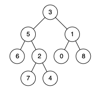
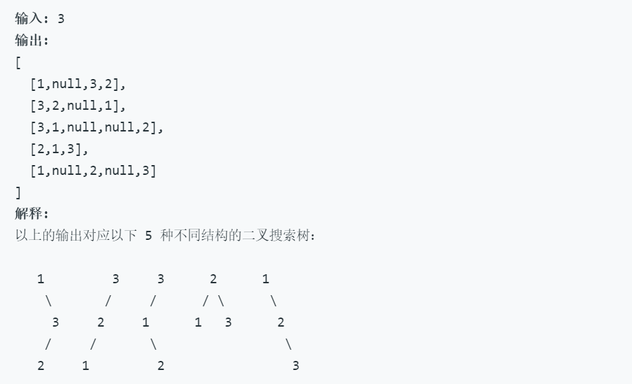

## 目录

+ [二叉树](### 二叉树)
+ [1.二叉树定义](#### 1.二叉树定义)
  
+ [2.二叉树的遍历](#### 2.二叉树的遍历)
+ [练习题目](### 练习题目)
  + [二叉树的最近公共祖先](### 二叉树的最近公共祖先)
  + [不同的二叉搜索树 II](### 不同的二叉搜索树 II)

---


##基础知识

### 二叉树

#### 1.二叉树定义

二叉树是每个结点最多有两个子树的树结构。通常子树被称作“左子树”（left subtree）和“右子树”（right subtree）。
+ 完全二叉树

  若设二叉树的高度为h，除第 h 层外，其它各层 (1～h-1) 的结点数都达到最大个数，第h层有叶子结点，并且叶子结点都是从左到右依次排布，这就是完全二叉树。

+ 满二叉树

  除了叶结点外每一个结点都有左右子叶且叶子结点都处在最底层的二叉树。

+ 平衡二叉树

  平衡二叉树又被称为AVL树（区别于AVL算法），它是一棵二叉排序树，且具有以下性质：它是一棵空树或它的左右两个子树的高度差的绝对值不超过1，并且左右两个子树都是一棵平衡二叉树。

+ 二叉搜索树

  或者是一棵空树，或者是具有下列性质的二叉树： 若它的左子树不空，则左子树上所有结点的值均小于它的根结点的值； 若它的右子树不空，则右子树上所有结点的值均大于它的根结点的值

#### 2.二叉树的遍历

前序
```cpp
class Solution {
public:
    vector<int> preorderTraversal(TreeNode* root) {
        vector<int> res;
        pre(res,root);
        return res;
    }
    void pre(vector<int> &res,TreeNode *node)
    {
        stack<TreeNode *> s;
        while(!s.empty() ||node)
        {
            while(node)
            {
                res.push_back(node->val);//这里访问
                s.push(node);
                node = node->left;
            }
            node = s.top();s.pop();
            node = node->right;
        }
    }
};
```
中序
```cpp
class Solution {
public:
    vector<int> inorderTraversal(TreeNode* root) {
        vector<int> res;
        mid(res,root);
        return res;
    }
    void mid(vector<int> &res,TreeNode *node)
    {
        stack<TreeNode *> s;
        while(!s.empty() ||node)
        {
            while(node)
            {
                s.push(node);//这里访问
                node = node->left;
            }
            node = s.top();s.pop();
            res.push_back(node->val);
            node = node->right;
        }
    }
};
```
后续
``` cpp
class Solution {
public:
    vector<int> postorderTraversal(TreeNode* root) {
        vector<int> res;
        if(!root) return res;
        stack<TreeNode *> s;
        TreeNode * cur = root;
        TreeNode * last= NULL;                  //last标记上一次访问的结点
        while(!s.empty()||cur)
        {
            while(cur)
            {
                s.push(cur);
                cur = cur->left;
            }
            cur = s.top();
            if(!cur->right || last==cur->right)//若当前结点没有右孩子，
            {                                  //或右孩子已经访问过，则访问当前结点
                res.push_back(cur->val);
                last = cur;
                s.pop();cur = NULL;            //将cur置为空，免得进入11行的循环
            }
            else cur = cur->right;             //否则访问右子树
        }
        return res;
    }
};
```
##练习题目
### [二叉树的最近公共祖先](https://leetcode-cn.com/problems/lowest-common-ancestor-of-a-binary-tree/submissions/)

**题目:**
给定一个二叉树, 找到该树中两个指定节点的最近公共祖先。

百度百科中最近公共祖先的定义为：“对于有根树 T 的两个结点 p、q，最近公共祖先表示为一个结点 x，满足 x 是 p、q 的祖先且 x 的深度尽可能大（一个节点也可以是它自己的祖先）。”

例如，给定如下二叉树:  root = [3,5,1,6,2,0,8,null,null,7,4]


示例 1:
>输入: root = [3,5,1,6,2,0,8,null,null,7,4], p = 5, q = 1
输出: 3
解释: 节点 5 和节点 1 的最近公共祖先是节点 3。

示例 2:
>输入: root = [3,5,1,6,2,0,8,null,null,7,4], p = 5, q = 4
输出: 5
解释: 节点 5 和节点 4 的最近公共祖先是节点 5。因为根据定义最近公共祖先节点可以为节点本身。


**说明:**
所有节点的值都是唯一的。
p、q 为不同节点且均存在于给定的二叉树中。

> 备注：LCA这个题目你好久没碰到过，应该复习复习二叉树的相关算法了，解析看你的代码备注

```cpp
/**
 * Definition for a binary tree node.
 * struct TreeNode {
 *     int val;
 *     TreeNode *left;
 *     TreeNode *right;
 *     TreeNode(int x) : val(x), left(NULL), right(NULL) {}
 * };
 */
class Solution {
public:
    TreeNode* lowestCommonAncestor(TreeNode* root, TreeNode* p, TreeNode* q) {
        if(!root || !p ||!q) return NULL;       //有一个为空则root为根结点的树查找失败，返回NULL
        if(root == p || root == q) return root; //当前结点是要查找的结点，立即返回当前结点
        TreeNode * left = lowestCommonAncestor(root->left,p,q);
        TreeNode * right= lowestCommonAncestor(root->right,p,q);
        if(left && right) return root;          //左右子树均查找到结果，当前结点是LCA，返回当前根节点
        else if(!left) return right;            //左子树未查找到，返回右子树，若右子树未查找到，返回的是NULL
        else return left;                       //否则返回左子树
    }
};
```

### [不同的二叉搜索树 II](https://leetcode-cn.com/problems/unique-binary-search-trees-ii/submissions/)


**备注：**

> 什么是二叉搜索树(BST-Binary Search Tree)
二叉查找树（叉搜索树，二叉排序树）它或者是一棵空树，或者是具有下列性质的二叉树： 若它的左子树不空，则左子树上所有结点的值均小于它的根结点的值； 若它的右子树不空，则右子树上所有结点的值均大于它的根结点的值； 它的左、右子树也分别为二叉排序树。


**题目：**
给定一个整数 n，生成所有由 1 ... n 为节点所组成的二叉搜索树。

**示例：**



**思路:**
深度优先搜索：如果要生成从1到n这n个数所构成的所有BST，按照其根节点的数值可以分为n种类型：即根节点的值为从1...n。
假设我们要生成根节点为k (1 <= k <= n)的所有BST，那么首先需要生成范围为1到k-1的所有BST作为左子树，以及范围为k+1到n的所有BST作为右子树，（要注意[1,k-1]范围内的构建的搜素子树也可能有多种形态，[k+1,n]同理，所以需要左右子树不同形态进行组合）然后两两组合(使用双重for循环)就可以形成根节点为k的所有BST（注意思考这里面为什么可以保证没有重复的？）。

```cpp
class Solution {
public:
    vector<TreeNode*> generateTrees(int n) {
        vector<TreeNode *> res;
        if(!n) return res;
        helper(res,1,n);
        return res;
    }
    
    void helper(vector<TreeNode *> &res,int start,int end)
    {
        if(start>end)
        {
            res.push_back(NULL);
            return;
        }
        for(int i=start;i<=end;++i)//遍历根节点，递归生成其左右子树
        {
            vector<TreeNode *> left;
            vector<TreeNode *> right;
            helper(left,start,i-1);
            helper(right,i+1,end);
            //组合所有形态的左右子树
            for(auto l:left)
                for(auto r:right)
                {
                    TreeNode * node = new TreeNode(i);
                    node->left = l;
                    node->right = r;
                    res.push_back(node);
                }
            }
    }
};
```


