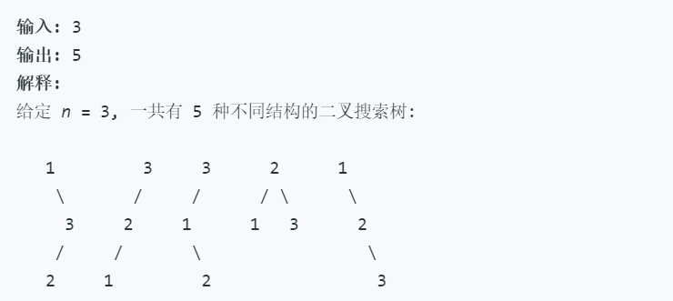
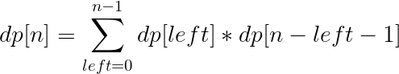

## [不同的二叉搜索树](https://leetcode-cn.com/problems/unique-binary-search-trees/)

**题目**
给定一个整数 n，求以 1 ... n 为节点组成的二叉搜索树有多少种？

**示例**


**思路**
假设一共是n个节点，那么根节点是肯定有一个的。

剩下的n-1个节点则要分配给根节点的左子树和右子树，那么分给左子树的个数`left​`可能是`0或1或2.....或n-1​`；右边则是`(n-1)- left​`个。则可转化为计算更小规模的不同搜索树种数的问题--->动态规划/分治法

> 且注意：当给定个数为x的时候，这个二叉搜索树里面的数字不管是`1,2,3....x`还是`3,4,5,....,x+3`其实效果是一样的，我们只要考虑数字列的次序就可以了，它实际上是什么数字是不重要的。因此，对于1,2两个数字来说dp[2]=2；对于2,3两个数字来说dp[2]=2仍然是成立的。

另外还要注意某个根结点的搜索树种类等于左右两边子树的可能种数值相乘，不是相加。
动态规划转化公式：



**代码**

```cpp
class Solution {
public:
    //法四、优化空间的动态规划
    //可以发现子问题只与规模相关，同等规模时，与子问题的种类无关
    int numTrees(int n)
    {
        if(n<3) return n;
        vector<int> dp(n+2,0);
        dp[0] = dp[1] = 1;//dp[0]要初始化为1，以使dp[0]*dp[n-1]不至为0
        for(int parentNum= 2;parentNum<=n;++parentNum)//树的总规模
            for(int leftChildNum=0;leftChildNum<parentNum;++leftChildNum)//左子树规模
                dp[parentNum] += (dp[leftChildNum] * dp[parentNum - 1 - leftChildNum]);
                //dp[parentNum - 1 - leftChildNum]是右子树规模
        return dp[n];
    }
    /*
    //法三、带备忘录的递归====>动态规划算法
    //把显示的用递归求子问题，换成子问题迭代
    int numTrees(int n) {
        vector<vector<int>> memo(n+2,vector<int>(n+1,0));
        int end;
        for(int len = 0;len<=n;++len)
            for(int start=1;start<=n+1-len;++start)
            {
                end = start+len-1;
                if(start>=end)
                {
                    memo[start][end] = 1;
                    continue;
                }
                for(int mid=start;mid<=start+len-1;++mid)
                    memo[start][end] += (memo[start][mid-1]*memo[mid+1][end]);
            }
        return memo[1][n];
    }
    */
    
    /*
    //法二、带备忘录的递归算法
    int numTrees(int n) {
        vector<vector<int>> memo(n+2,vector<int>(n+1,0));
        return helper(1,n,memo);
    }
    int helper(int start,int end,vector<vector<int>>& memo)
    {
        if(memo[start][end]) return memo[start][end];//若已经计算过，可以偷懒直接返回
        if(start>=end) 
        {
            memo[start][end] = 1;
        }
        else{
            for(int mid=start;mid<=end;++mid)
            {
                memo[start][mid-1] = helper(start,mid-1,memo);
                memo[mid+1][end] = helper(mid+1,end,memo);
                memo[start][end] += (memo[start][mid-1]*memo[mid+1][end]);
            }
            
        }
        return memo[start][end];
    }
    */
    
    /*
    //法一、暴力递归算法
    int numTrees(int n) {
        return helper(1,n);
    }
    int helper(int start,int end)
    {
        if(start>=end) return 1;
        int num =0;
        for(int mid=start;mid<=end;++mid)
            num += (helper(start,mid-1)*helper(mid+1,end));
        return num;
    }
    */
};
```

