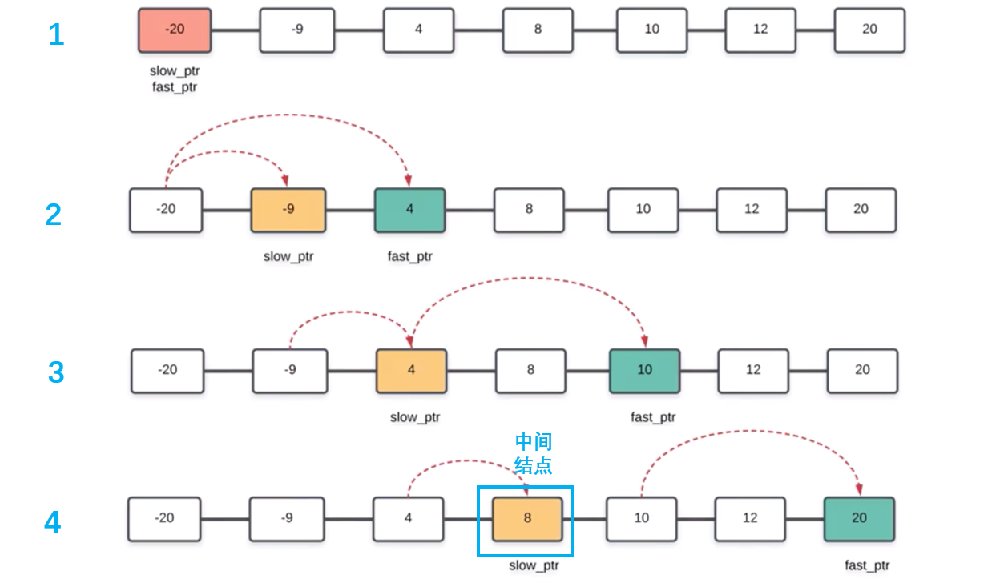

## 访问链表的一些注意事项

链表常见的问题有多链表归并，交换链表中的结点，对链表进行排序（一个单链表可用直接插入法，两个单链表可用归并方法）等

会涉及头插法、尾插法等链表的访问、操作方法

操作链表时，若空间允许可以人为增加一个头结点，这样链表的很多操作都统一了，比较方便。

## 如何在单链表中找中间结点

使用快慢指针slow，fast，快指针每走两步，慢指针走一步，快指针遍历完整个链表时，慢指针刚好指向链表中间结点。

若要找到中间结点之前一个结点，可以让慢指针晚一步走。




## [k个一组翻转链表](https://leetcode-cn.com/problems/reverse-nodes-in-k-group/)

**题目**

给出一个链表，每 *k* 个节点一组进行翻转，并返回翻转后的链表。

*k* 是一个正整数，它的值小于或等于链表的长度。如果节点总数不是 *k* 的整数倍，那么将最后剩余节点保持原有顺序。

**示例 :**

给定这个链表：`1->2->3->4->5`

当 *k* = 2 时，应当返回: `2->1->4->3->5`

当 *k* = 3 时，应当返回: `3->2->1->4->5`

**说明 :**

+ 你的算法只能使用常数的额外空间。
+ **你不能只是单纯的改变节点内部的值**，而是需要实际的进行节点交换。

**代码:**
> **感悟:**该题目并不难，但是你首次做却做了很久，一是不太熟悉链表操作了，而是C/C++语言的指针用法不熟悉了，忘了函数传参时什么时候会改变实参什么时候又不会。

```c++
 ListNode* reverseKGroup(ListNode* head, int k) {
        struct ListNode * linkNode= new ListNode(0);
        struct ListNode * left=linkNode;
        struct ListNode * right= head;
        linkNode->next = head;
        int dist = 1;
        while(right)
        {
            dist =1;
            while(right&&dist<k)
            {
                right=right->next;
                dist+=1;
            }
            if(right&&dist==k)
            {
                cout<<left->val<<" "<<right->val<<endl;
                reverseSection(left,right);
                left = right;
                right = left->next;
            }
            else
                break;
            cout<<"right->val"<<right->val<<endl;
        }
        head = linkNode->next;
        delete linkNode;
        return head;
    }
    void reverseSection(ListNode * &headPre,ListNode * &tail)//headPre是局部链表的首结点之前的一个结点（相当于头结点）
        //局部反转链表
    {
        if(headPre==NULL)
            return;
        struct ListNode * p= headPre->next;
        struct ListNode * q=NULL;
        struct ListNode * last=tail->next;
        tail = headPre->next;
        headPre->next = last;
        while(p!=last)
        {
            q = p->next; 
            p->next = headPre->next;
            headPre->next = p;
            p = q;
        }
        cout<<"tail="<<tail->val<<endl;
    }
```
## [删除排序链表中的重复元素-II](https://leetcode-cn.com/problems/remove-duplicates-from-sorted-list-ii/)

**题目**
给定一个排序链表，删除所有含有重复数字的节点，只保留原始链表中 没有重复出现 的数字。

**示例 1:**

输入: 1->2->3->3->4->4->5
输出: 1->2->5
**示例 2:**

输入: 1->1->1->2->3
输出: 2->3

>感悟：这道题目你纠结了好久，做这么长时间原因有两点，①没有画图直接凭空想象（做链表题目画画示意图可以直观的演示结点、指针操作过程，下次一定要记得画图），②可以自己为链表添加一个头结点，这样链表的操作就会统一，减少很多特殊情况的思考。
```cpp
/**
 * Definition for singly-linked list.
 * struct ListNode {
 *     int val;
 *     ListNode *next;
 *     ListNode(int x) : val(x), next(NULL) {}
 * };
 */
class Solution {
public:
    ListNode* deleteDuplicates(ListNode* head) {
        //自己添加一个头结点，可以统一链表的操作，少很多麻烦
        if(!head) return head;
        ListNode * p = new ListNode(0);
        p->next = head;
        head = p;
        ListNode * left ,*right;
        while(p->next)
        {
            left=p->next;right = left;
            while(right->next && right->next->val == left->val)
                right=right->next;
            if(right==left)//left，right指向同一结点，该结点的值没有重复出现，不需要裁剪这个结点
                p=p->next;
            else//裁剪
                p->next=right->next;
        }
        return head->next;
    }
};
```