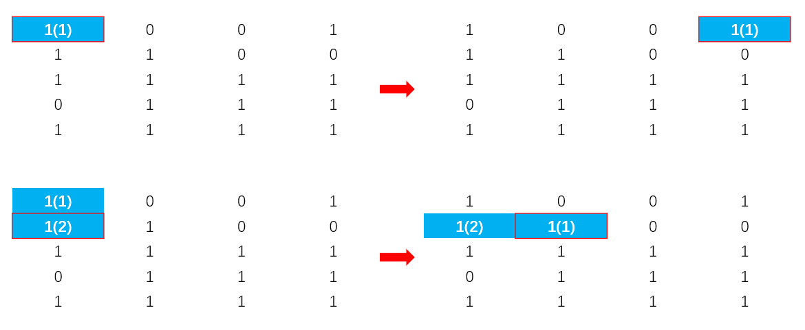
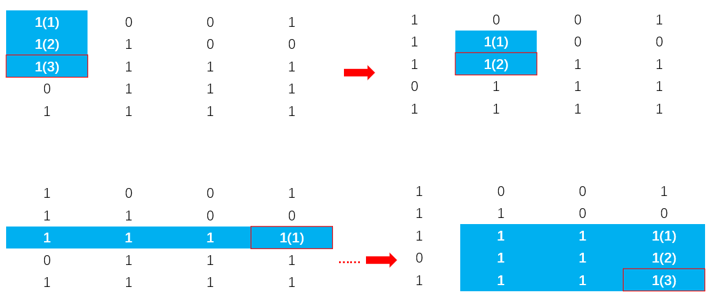

## [最大矩形](https://leetcode-cn.com/problems/maximal-rectangle/)

**题目：**
给定一个仅包含 0 和 1 的二维二进制矩阵，找出只包含 1 的最大矩形，并返回其面积。

**示例:**

输入:
[

  ["1","0","1","0","0"],

  ["1","0","1","1","1"],

  ["1","1","1","1","1"],

  ["1","0","0","1","0"]

]
输出: 6

**解析：**

c++ 逐层压缩,使用单调栈求每层最大矩形面积
用动态规划的思想，从上层得到下一层能建立的柱体的最大高度
然后在每一层借用单调栈求出以该柱体为高的最大矩形面积
只用将每个结点遍历一次，时间复杂度为O(MN)，有一个dp数组记录每一层所能建立柱体的高度，空间复杂度为O(M)，M，N分别为矩阵matrix长，宽。

**示意图：

红色边框勾出矩阵遍历过程
表格中数字旁边的括号标出当前dp[i]的值
蓝色填充区域表示矩阵中以当前结点为右下角，能完全包含该结点高度的矩形最大面积



```cpp
class Solution {
public:
    int maximalRectangle(vector<vector<char>>& matrix) {
        if(!matrix.size()) return 0;
        vector<int> dp(matrix[0].size(),0);//dp用于记录以某一层为底，与之前的所有上层可以形成的连续高度
        int maxArea = 0;
        /*
        循环中调用amxRectangleArea()算法，
        用于找到在一层中结点matrix[i][j]完整包含dp[j]高度的最大宽度
        面积就等于找到的长 * 宽
        */
        for(int i=0;i<matrix.size();++i)
        {
            for(int j=0;j<matrix[0].size();++j)
            {
                dp[j] = (matrix[i][j]=='1') ? dp[j]+1 : 0;
            }
            maxArea=max(maxArea,maxRectangleArea(dp));
        }
        return maxArea;
    }
private:
    //84.柱状图中最大的矩形 的代码，
    //用于找到nums中完整包含当前高度的最长宽度
    int maxRectangleArea(vector<int> &nums)
    {
        stack<int> s;//单调栈
        nums.push_back(0);//设置一个哨兵，让nums遍历到最后时，获得的柱体高度可让单调栈前面的所有元素出栈
        int maxArea = 0;
        for(int i=0;i<nums.size();++i)
        {
            while(!s.empty() && nums[i]<=nums[s.top()])
            {
                int top = s.top();s.pop();
                maxArea = max(maxArea,nums[top]*(s.empty()?i:i-s.top()-1));
            }
            s.push(i);
        }
        nums.pop_back();
        return maxArea;
    }
};
```

